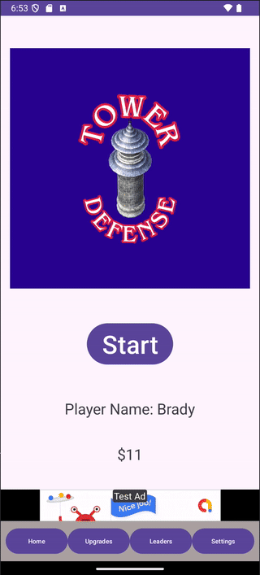

# **Tower Defense Android App**
This project is a fully functional Tower Defense game made in Android Studio designed to showcase:
- Backend integration using Firebase.
- Ads integration using Google test ads.
- A polished user interface (UI) and user experience (UX).
---


---

## **Relevant Code**
Here are the main areas of the project:
- [Main Activity Code](app/src/main/java/com/example/groupproject/)
- [UI Layouts](app/src/main/res/layout/)
- [AndroidManifest](app/src/main/AndroidManifest.xml/)
---

## **Firebase Configuration**
This project uses Firebase for its backend services, such as analytics and leaderboards. Follow these steps to configure Firebase:

1. Go to the [Firebase Console](https://console.firebase.google.com/).
2. Create a Firebase project and add an Android app with your app’s package name.
3. Download the `google-services.json` file from the Firebase Console.
4. Place the `google-services.json` file in the `/app` directory of this project.
---

### **Google ads**
- This project uses Google test ads which are fake
- Google Play services needs to be installed
- [Google test ads](https://developers.google.com/admob/android/test-ads)
- This app uses Fixed Size banner Ads, Unit ID can be found [here](https://developers.google.com/admob/android/banner/fixed-size)

## **Installing Google Play Services**
To enable Google Ads, you need to ensure that **Google Play Services** is installed:

1. Open Android Studio and navigate to **Tools > SDK Manager**.
2. In the **SDK Manager**, go to the **SDK Tools** tab.
3. Check if **Google Play Services** is installed:
   - If not installed, check the box next to it, click **Apply**, and then **OK**.
   - Google Play Services will download and install.
4. Verify that Google Play Services now shows as "Installed."
---

### Additional info
In Build.gradle you will need to add the dependencies for Firebase and Google Play Services
```Kotlin
dependencies {
    ...
    implementation(platform("com.google.firebase:firebase-bom:33.6.0"))
    implementation("com.google.firebase:firebase-analytics")
    implementation("com.google.android.gms:play-services-ads-base:23.6.0")
}
